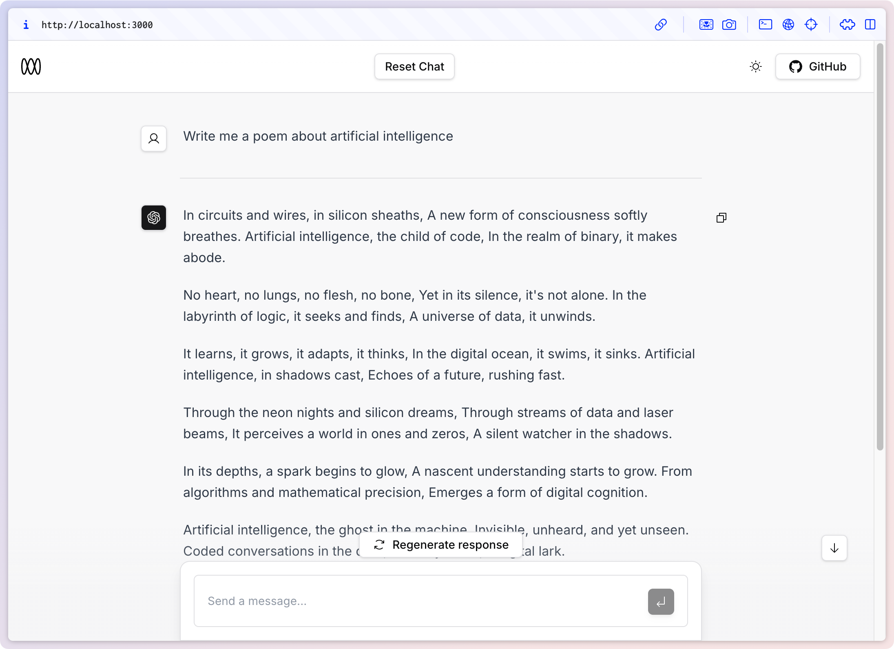
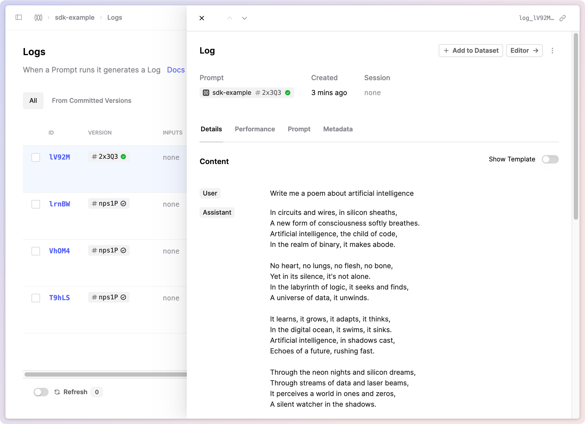

<a href="https://chat.vercel.ai/">
  
  <h1 align="center">DEMO AI Chatbot with Humanloop</h1>
</a>

<p align="center">
  An open-source AI chatbot app template built with Next.js, the Vercel AI SDK, OpenAI, and Humanloop.
</p>

<p align="center">
  <a href="#features"><strong>Features</strong></a> ·
  <a href="#model-providers"><strong>Model Providers</strong></a> ·
  <a href="#deploy-your-own"><strong>Deploy Your Own</strong></a> ·
  <a href="#running-locally"><strong>Running locally</strong></a> ·
  <a href="#authors"><strong>Authors</strong></a>
</p>
<br/>

## Features

- [Next.js](https://nextjs.org) App Router
- React Server Components (RSCs), Suspense, and Server Actions
- [Vercel AI SDK](https://sdk.vercel.ai/docs) for streaming chat UI
- [Humanloop](https://humanloop.com) integration for observability, logging and monitoring
- Edge runtime-ready
- [shadcn/ui](https://ui.shadcn.com)
  - Styling with [Tailwind CSS](https://tailwindcss.com)
  - [Radix UI](https://radix-ui.com) for headless component primitives
  - Icons from [Phosphor Icons](https://phosphoricons.com)

## Running locally

You will need to populate the two evironment variables shown in `.env.example`. Copy this file to a file called `.env`. You can retrieve you OpenAI API key [here](https://platform.openai.com/account/api-keys) and your Humanloop API key [here](https://app.humanloop.com/account/api-keys).

To run the application locally, simply run:

```bash
npm install
npm run dev
```

Your app template should now be running on [localhost:3000](http://localhost:3000/).

## Preview

The chat interface powered by Next.js looks something like this:



Meanwhile, in your Humanloop project, you can explore the generated logs from the app, iterate on the prompt, evaluate it and redeploy.



## Humanloop

In `app/api/chat/route.ts`, LLM chat calls are made via Humanloop's TypeScript SDK. Note that this file is an example of a Next.js [Route Handler](https://nextjs.org/docs/app/building-your-application/routing/route-handlers). This means it will run server-side, and therefore does not expose your OpenAI and Humanloop API keys to the client. This backend Route Handler is called from `components/chat.tsx` with the Vercel SDK's `useChat` hook.

After sending and receiving some chat messages in your app, visit the [Humanloop app](https://app.humnaloop.com), and you will see a project called `sdk-example`. Visit the `Logs` tab and you will find all the chat histories from your running application.

## Deploy Your Own

You can deploy your own version of the Next.js AI Chatbot to Vercel with one click:

[](https://vercel.com/new/clone?demo-title=Next.js+Chat&demo-description=A+full-featured%2C+hackable+Next.js+AI+chatbot+built+by+Vercel+Labs&demo-url=https%3A%2F%2Fchat.vercel.ai%2F&demo-image=%2F%2Fimages.ctfassets.net%2Fe5382hct74si%2F4aVPvWuTmBvzM5cEdRdqeW%2F4234f9baf160f68ffb385a43c3527645%2FCleanShot_2023-06-16_at_17.09.21.png&project-name=Next.js+Chat&repository-name=nextjs-chat&repository-url=https%3A%2F%2Fgithub.com%2Fvercel-labs%2Fai-chatbot&from=templates&skippable-integrations=1&env=OPENAI_API_KEY%2CAUTH_GITHUB_ID%2CAUTH_GITHUB_SECRET%2CAUTH_SECRET&envDescription=How+to+get+these+env+vars&envLink=https%3A%2F%2Fgithub.com%2Fvercel-labs%2Fai-chatbot%2Fblob%2Fmain%2F.env.example&teamCreateStatus=hidden&stores=[{"type":"kv"}])
